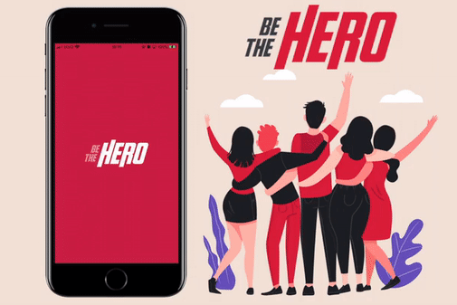

<h1 align="center">
  
</h1>

<h4 align="center">
 🚀 Semana OmniStack 11.0
</h4>

  

  
  
  

  

  

  <a href="#rocket-tecnologias">Tecnologias</a>&nbsp;&nbsp;&nbsp;|&nbsp;&nbsp;&nbsp;
  <a href="#funcionalidades">Funcionalidades</a>&nbsp;&nbsp;&nbsp;|&nbsp;&nbsp;&nbsp;
  <a href="#memo-license">License</a>

  

# Mobile App 

Proposta era uma aplicação mobile para os heróis visualizar os casos e contactar suas respectivas ONGs.
 
Aplicação desenvolvida com React Native e expo, consumindo a API REST (back-end) com axios para as requisições de dados.

## :rocket: Tecnologias

- [React Native](https://react-native.org)
- [EXPO](https://expo.io/)
- [axios](https://github.com/axios/axios)

## Funcionalidades

- Listar casos de ONGs
- Detalhe dos casos
- Iniciar aplicação como WhatsApp ou E-mail para o contato.

### Link do GitHub Front-end:

[Aplicação Front-end https://github.com/remulocosta/frontend-omnistack11](https://github.com/remulocosta/frontend-omnistack11)

### Link do GitHub Back-end:

[Aplicação Back-end https://github.com/remulocosta/backend-OmniStack11](https://github.com/remulocosta/backend-OmniStack11)

--
